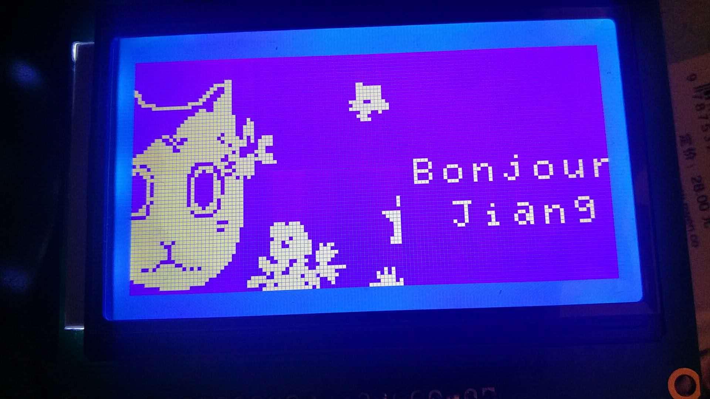

# LCD12864 with Pi

This is mainly for fun.

What You can do:
1. show Your Picture in LCD12864: you can generate the dot matrix by [G.java](bitmap_generater/G.java) and show it. Like this:

Wiring thing
[LED12864](res/12864-line.png)
[switch](res/switch_line.png)

[Install wiringPi](http://wiringpi.com/download-and-install/)

And just entry it.

P.S. Thanks [wusiyu](https://wusiyu.me/) for his example, I do learn a lot from his blog.