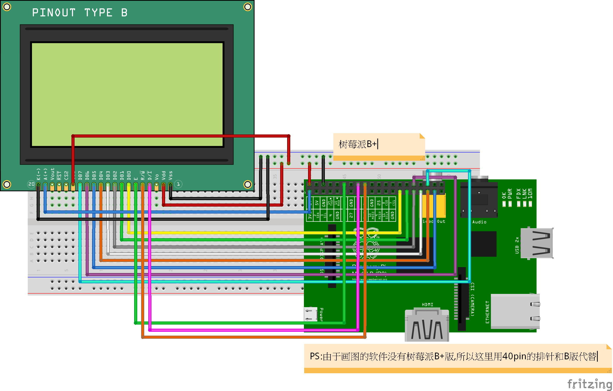

# LCD12864 with Pi

This is mainly for fun.

Wiring thing:

Install wiringPi:
http://wiringpi.com/download-and-install/

And just entry it.

P.S. Thanks https://wusiyu.me/ for his example, I do learn a lot from him.