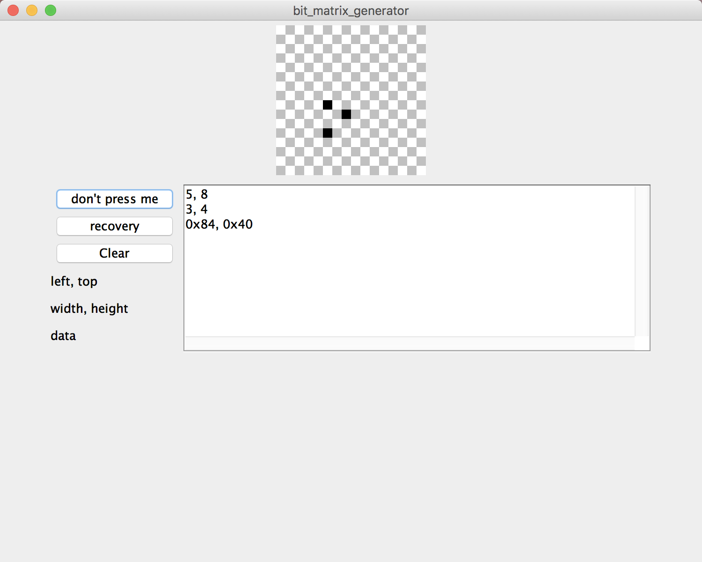

A tool.

Give a GUI to draw pixel things on it, and generate bit matrix for sprite.

Lalala....
New Function:

What we did is [dot-picture] => [data-matrix], now we can [data-matrix] => [dot-picture] ~~
Try the "recovery" button~

Like this:

